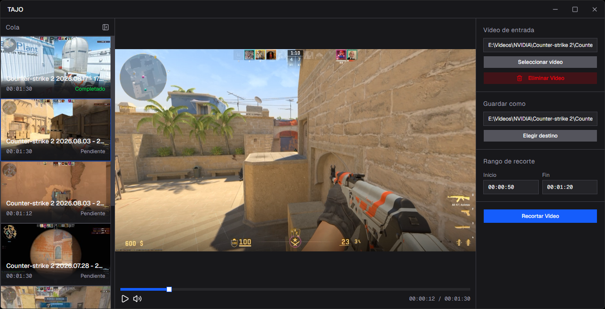

# Tajo
Simple, lightweight desktop video editor built for quick video trimming. It isn't meant to replace other full-fledged video editing software. There are no complex timelines or heavy effects here.

Created both as a practical tool for everyday clip editing and as a learning project to explore Rust and [Tauri v2](https://v2.tauri.app/).

> [!NOTE]
> The app is currently available in Spanish only. English support will be added in a future release.



## Status

This project is actively in development. Main features right now include:
- Load a video (file picker or drag and drop)
- Preview with a built-in player
- Trim
- Export to a chosen path

## Planned Features
Some of the features planned for future releases include:
- English language support
- Linux compatibility
- Expand editing options (format conversion, compression, etc.)

## Stack

<p align="left">
  <a href="https://v2.tauri.app/"></a>&nbsp;&nbsp;
  <a href="https://react.dev/"></a>&nbsp;&nbsp;
  <a href="https://www.typescriptlang.org/"></a>&nbsp;&nbsp;
  <a href="https://tailwindcss.com/"></a>&nbsp;&nbsp;
  <a href="https://www.rust-lang.org/"></a>&nbsp;&nbsp;
  <a href="https://ffmpeg.org/"></a>
</p>

- [Tauri v2](https://v2.tauri.app/) (web frontend + Rust backend)
- React + TypeScript + Tailwind CSS v4 + shadcn/ui
- Rust for the operations engine (building and running ffmpeg commands)
- ffmpeg and ffprobe as external processes

## Running locally

### Requirements:

- System dependencies: Make sure you have the required build tools for your OS installed (see [Tauri Prerequisites](https://v2.tauri.app/start/prerequisites/)).
- [Node.js](https://nodejs.org/).
- [pnpm](https://pnpm.io/installation) is optional, but it’s the package manager used during development.
- [Rust](https://www.rust-lang.org/tools/install).
- `ffmpeg` and `ffprobe` binaries. Download standard static builds for your operating system.

### Setup:
Tauri v2 uses Sidecars to bundle external binaries like `ffmpeg` and `ffprobe`. To run the project, the binaries in `src-tauri/binaries/` must include your target triple in their filename.

1. Find your Rust host triple by running:
   ```bash
   rustc --print host-tuple
   ```
2. Rename the binaries to match your host triple and move them to `src-tauri/binaries/`. For example, if your host triple is `x86_64-pc-windows-msvc`, rename the binaries to `ffmpeg-x86_64-pc-windows-msvc.exe` and `ffprobe-x86_64-pc-windows-msvc.exe`.

3. Install dependencies and run the app:
    ```bash
    pnpm install
    pnpm tauri dev
    # if you want the production build, run:
    # pnpm tauri build
    ```